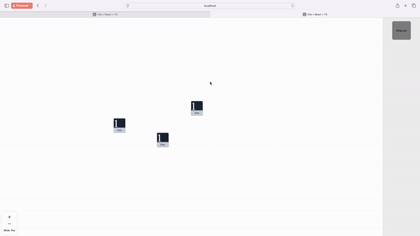
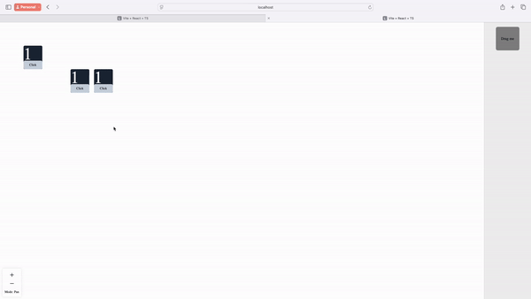
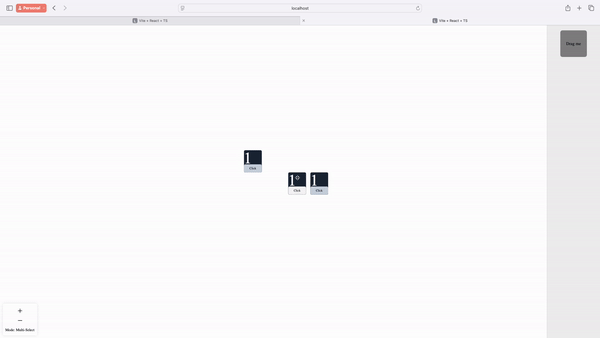

# Concept: Whiteboard with ReactComponents

The idea is to build something similar to Miro, but instead of using a canvas or SVG, the focus will be on React components. These components will be fully interactive, supporting drag-and-drop functionality and more. Alternatively, it could evolve into a sandbox or an interactive dashboard where users can arrange and manipulate React components on a whiteboard-like interface.

## use cases

Component-Based Dashboard Builder

**Idea:** Allow users to create custom dashboards by dragging and dropping React components that represent widgets, charts, and data visualizations.

**Features:**
	  •	Drag and drop widgets like graphs, data tables, and notifications.
	  •	Real-time updates with live data streams (e.g., stock prices, analytics).
	  •	Responsive layout for mobile and desktop views.

######  React + TypeScript + Vite
