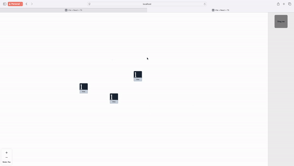
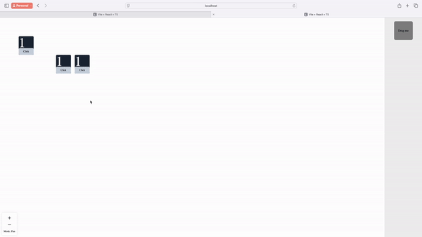
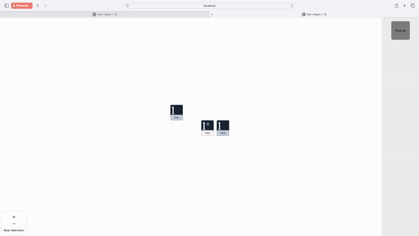

# Concept: Whiteboard with ReactComponents

The idea is to build something similar to Miro, but instead of using a canvas or SVG, the focus will be on React components. These components will be fully interactive, supporting drag-and-drop functionality and more. Alternatively, it could evolve into a sandbox or an interactive dashboard where users can arrange and manipulate React components on a whiteboard-like interface.

## Key Features

### FigJam-Style Interaction Model
- **Widget Components**: Draggable from entire surface with floating headers on selection
- **Shape Components**: Headerless geometric shapes (Rectangle, Ellipse, Arrow, Line, Text, Image)
- **Multi-Selection Support**: Select multiple components with Ctrl+click or marquee selection
- **Floating Headers**: Context-sensitive headers appear only when widgets are selected

### Keyboard Shortcuts
- **ESC**: Deselect all components (closes overview if open)
- **1**: Reset zoom to 100%
- **Shift+1**: Zoom to fit all components
- **2**: Zoom to selected components
- **3/O**: Toggle overview panel
- **Delete/Backspace**: Delete selected components
- **Ctrl+C**: Copy selected components
- **Ctrl+V**: Paste components
- **Ctrl+Shift+V**: Force paste image from clipboard

### Media Support
- **Image Paste/Drop**: Automatic image component creation from URLs, files, or clipboard
- **YouTube Integration**: Auto-detect and embed YouTube videos
- **SoundCloud Integration**: Embed SoundCloud tracks and playlists
- **Spotify Integration**: Embed Spotify tracks, albums, and playlists

## use cases

Component-Based Dashboard Builder

**Idea:** Allow users to create custom dashboards by dragging and dropping React components that represent widgets, charts, and data visualizations.

**Features:**
• Drag and drop widgets like graphs, data tables, and notifications.
• Real-time updates with live data streams (e.g., stock prices, analytics).
• Responsive layout for mobile and desktop views.

###### React + TypeScript + Vite
